

##  👋 Hello! Welcome to my the walk-through of the Collatz conjecture!

---

<b> In this walk-through, we: </b>

1. Introduce the Collatz conjecture and review some of its history <a href="https://en.wikipedia.org/wiki/Collatz_conjecture">here</a> and <a href="https://www.quantamagazine.org/mathematician-terence-tao-and-the-collatz-conjecture-20191211/">here</a>

2. Generate some code to demonstrate the principle and visually see it in action 

---

<b> A breif summary of the Collatz conjecture: </b>

"The Collatz conjecture is a conjecture in mathematics that concerns sequences defined as follows: start with any positive integer n. Then each term is obtained from the previous term as follows: if the previous term is even, the next term is one half of the previous term. If the previous term is odd, the next term is 3 times the previous term plus 1. The conjecture is that no matter what value of n, the sequence will always reach 1." 

[(source)](https://en.wikipedia.org/wiki/Collatz_conjecture)

---

<b> Some findings... </b>

The graphs below show how many steps it takes for a number to reach 1...

|  |  |
| :-------: | :-------: |
| 0 through 100 | 0 through 250 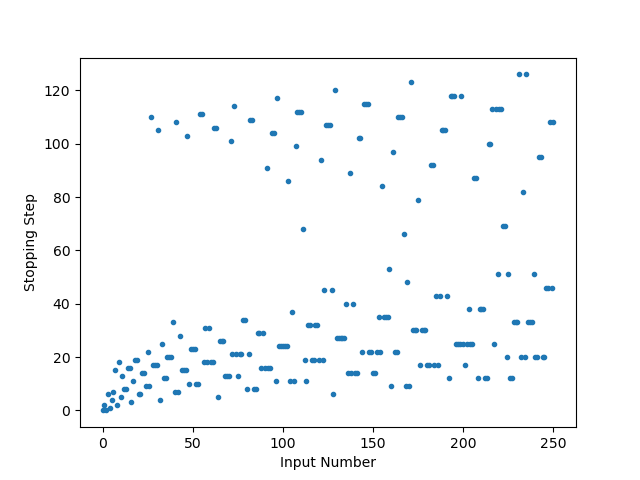 |
| 0 through  1,000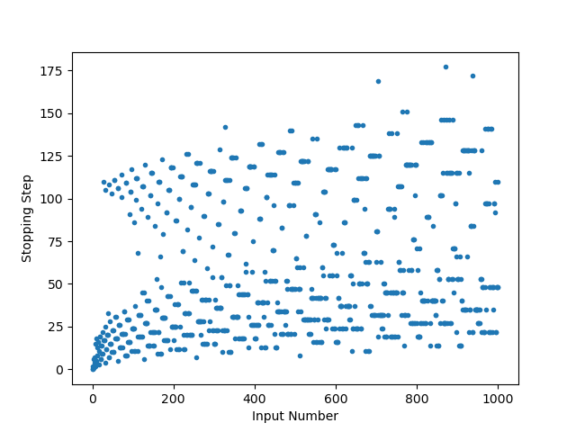 | 0 through 4,000 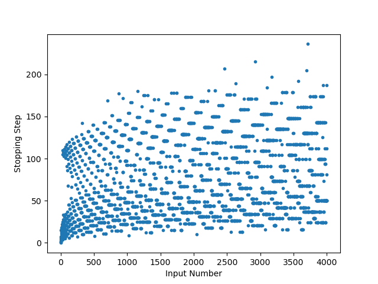
| 0 through 10,000 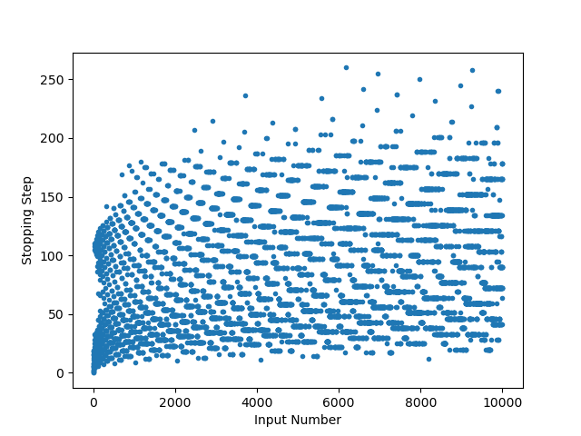 | 0 through 20,000 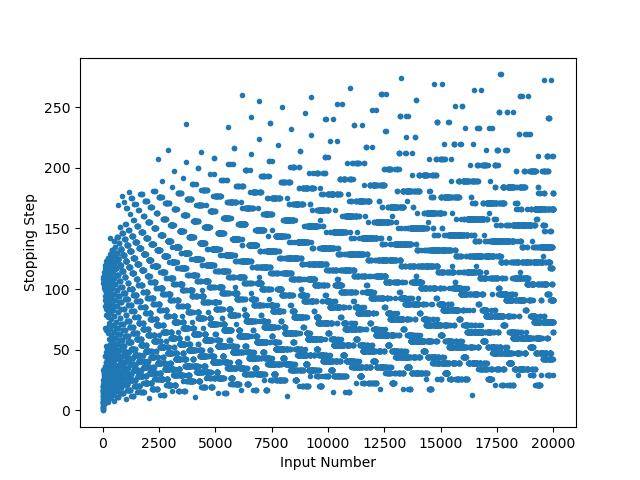 |
| 0 through 100,000 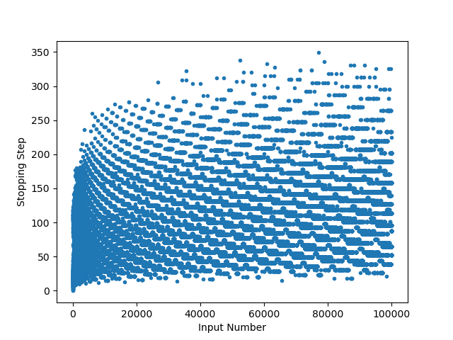 | 0 through 500,000 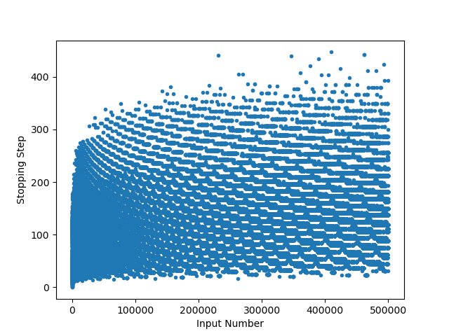 |

The graphs below shows the progression for a number to reach 1... 

|  |  |
| :-------: | :-------: |
| 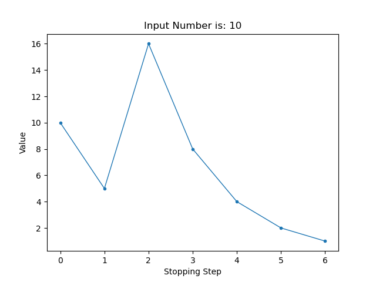 | 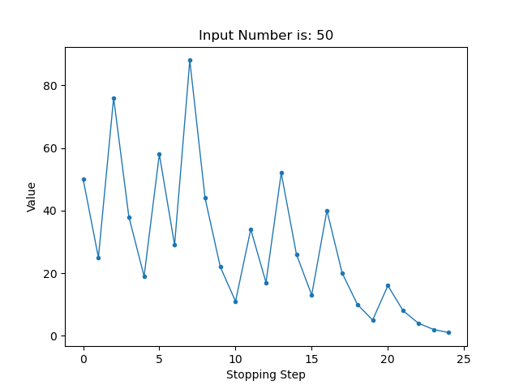 |
| 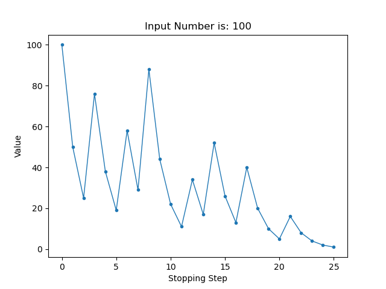 | 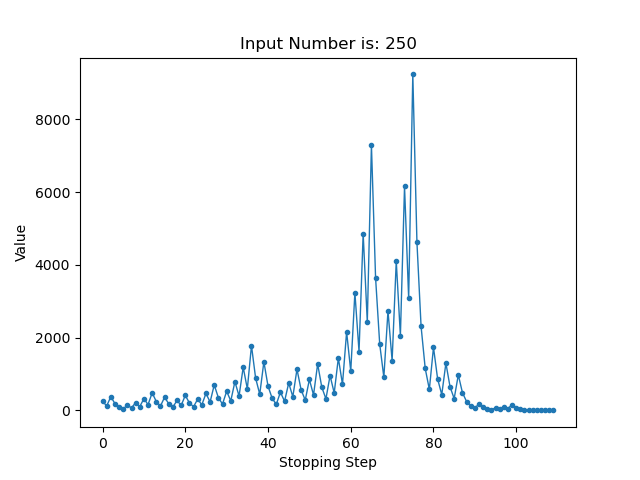 |
|  | 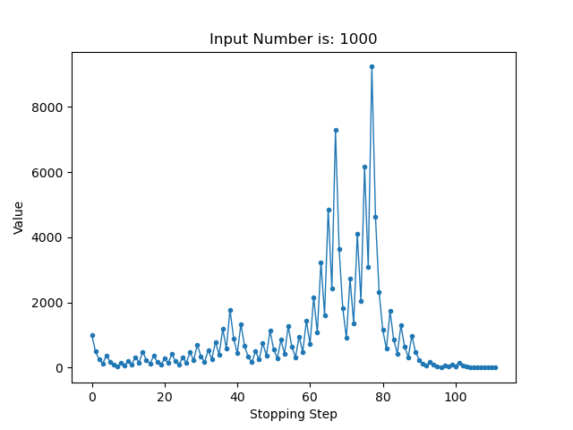 |
| 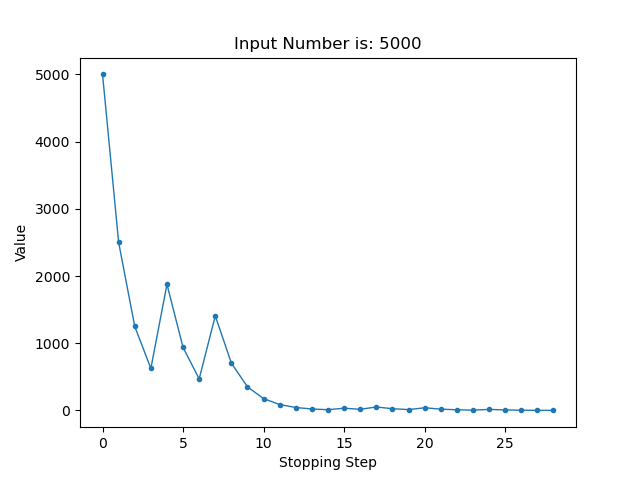 | 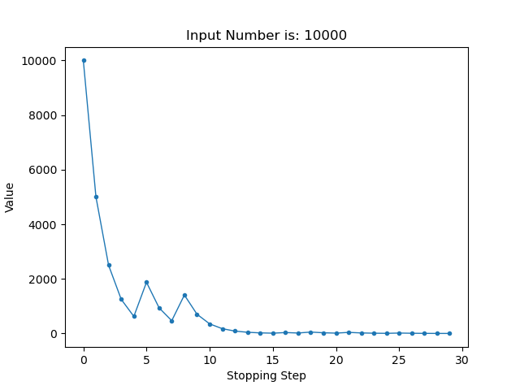 | 
| 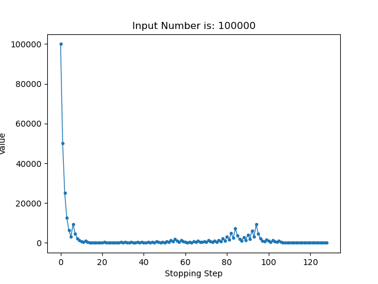 |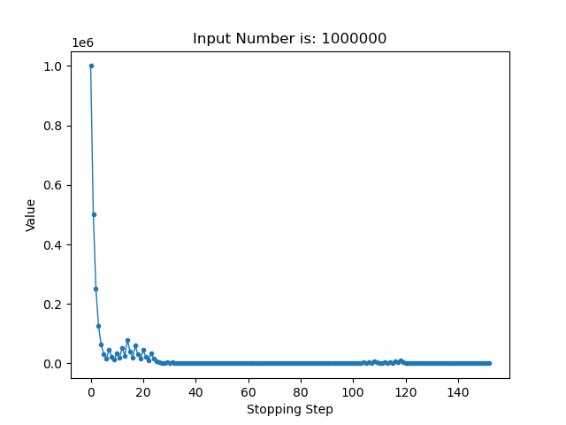 |

Unfortunately, to this day, there has not been any major patters found for this conjecture. The patterns may look similar when the input number becomes large, but there is now formula to predict the number of steps needed to reach the terminal value. 

---

<b> Check out some of the Educational Repos I have made... </b>

1) [Solution and Expansion of an Eigenvalue Problem](https://github.com/LiamNesterEducational/ExpansionOfAnEigenvalueProblem)
2) [Creating an N-bit Data Aquisition (DAQ) System](https://github.com/LiamNesterEducational/CreatingAnNBitDataAqSystem)

***Stay tuned for more!***

---

### Connect with me:

[][website] 

  

[][linkedin]

[website]: https://liamnester.github.io/
[linkedin]: https://www.linkedin.com/in/liamnester/